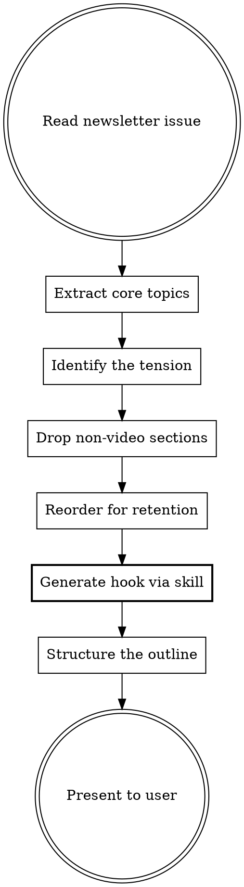

# Newsletter to YouTube Video Outline

Repurpose a newsletter issue into a high-level YouTube video outline. The output is topic-level only — no scripts, no talking points, no actual content. Just the topics you'll cover, structured for video.

## Why This Exists

Newsletter and YouTube are different mediums. Newsletters reward scanners — readers jump to what interests them. YouTube rewards retention — viewers watch linearly, and every moment competes with the back button. A straight 1:1 port of newsletter structure usually makes for a boring video. This skill restructures the content to match how people actually watch.

## When to Use

Use this skill when:
- Converting a newsletter issue into a YouTube video plan
- The user asks to repurpose newsletter content for YouTube
- Planning a video based on an existing newsletter issue
- The user mentions "video outline from newsletter" or similar

## Process



### Step 1: Read the Newsletter Issue

Read the full newsletter issue. Identify:
- The core thesis (what's the one main idea?)
- All distinct topics/subtopics covered
- The most surprising or counterintuitive finding
- Any limitations, trade-offs, or honest takes (these create tension)
- Personal experience and real results (these build credibility on camera)

### Step 2: Adapt for Video

**Drop these** — they don't translate to video:
- P.S. lines and email-specific CTAs (forward, reply)
- Preview text / subtitle
- Subject line options
- "Getting started" setup sections (install steps, config JSON) — unless the video is a tutorial
- Sections that only work as scannable text (comparison tables can become talking points, but raw tables don't work on screen)

**Promote these** — they work better on video than in text:
- Personal stories and anecdotes (these are gold on camera)
- Surprising findings or limitations (great for hooks and retention)
- Before/after comparisons (visual, easy to demonstrate)
- Live demos or walkthroughs (newsletter screenshots become video demos)

**Reorder for retention:**

YouTube viewers decide to stay or leave in the first 30 seconds. The newsletter hook might work as-is, but often the most interesting finding is buried in the middle or end of the newsletter. Pull it forward.

| Newsletter pattern | Video adaptation |
|---|---|
| Hook → Context → Content → Limitation → Close | Hook with the limitation → Why it matters → How it works → Limitation deep-dive → What's next |
| Hook → Problem → Solution → How-to → Close | Hook with the result → The problem → The solution → Quick demo → What's next |
| Hook → Feature overview → Cost → Limitations → Close | Hook with the tension (cost/limitation) → What it does → How it actually works → The honest trade-offs → Verdict |

The general principle: **lead with tension or surprise, deliver value in the middle, end forward-looking.** Tension is what keeps viewers watching. The newsletter can afford a slow build because readers scan ahead. Video can't.

### Step 3: Generate the Hook

**Invoke `content-strategy:hook`** to craft the video's opening hook.

Feed the skill this context from Steps 1–2:
- **The working title** (or a placeholder title describing the video topic)
- **The most surprising or counterintuitive finding** from the newsletter — this is almost always the best hook material
- **The core tension** (limitation, trade-off, honest take) identified in Step 1
- **The content type** (YouTube video) so the skill loads `references/youtube-hooks.md`

The skill will produce a hook that:
- Extends curiosity beyond the title (doesn't just repeat it)
- Lands within 5–15 seconds
- Avoids forbidden patterns (title repetition, welcome-first, unrelated tangent)
- Passes its own 7-point verification checklist

Include the skill's hook output in the outline's Hook section. The hook should be 2–3 sentences: what the viewer sees/hears and why it creates urgency to keep watching.

### Step 4: Build the Outline

Structure every outline with these sections. The Hook section comes from Step 3. The rest is topic-level only — 1-2 lines per section, not actual content.

```
## Hook (0:00–0:15)
[Generated by content-strategy:hook skill — 2-3 sentences
describing the opening: what the viewer sees/hears, the hook pattern used,
and the curiosity it creates]

## Setup
[What context the viewer needs to understand the rest — 1 sentence]

## Main Topics
[Each topic as a bullet — just the topic name and what aspect of it you'll cover]
- Topic 1: ...
- Topic 2: ...
- Topic 3: ...
[Usually 3-5 topics. More than 5 means the video is trying to cover too much.]

## Close
[How the video wraps — what the viewer should take away or do next]
```

Keep it tight. The outline for a 10-minute video should fit in under 15 lines (excluding the hook). If you're writing more than that, you're going past topic-level into content territory.

## Output Format

Present the outline as a single markdown block. Use the template structure above. No commentary outside the outline unless the user asks for it.

If a newsletter issue covers too many topics for one video, say so and suggest splitting into 2 videos with a recommended split point — but still produce the outline for the primary video.

## Brand Compliance

When creating video outlines for The AI Launchpad, invoke `branding-kit:brand-guidelines` to verify the hook and outline align with brand standards.

## Quality Checklist

Verify completion before finalizing:
- [ ] Newsletter issue fully read and core thesis identified
- [ ] Non-video sections dropped (P.S., subject lines, setup steps)
- [ ] Video-friendly elements promoted (stories, demos, surprises)
- [ ] Content reordered for retention (tension/surprise leads)
- [ ] `content-strategy:hook` invoked for hook generation
- [ ] Hook passes the skill's 7-point verification checklist
- [ ] Outline uses the template structure (Hook → Setup → Main Topics → Close)
- [ ] 3-5 main topics (not more)
- [ ] Each topic is a label + angle, not talking points
- [ ] Outline fits under 15 lines (excluding hook)

## Common Mistakes

| Mistake | Fix |
|---|---|
| Writing talking points instead of topics | Each bullet should be a topic label + angle, not what you'd say about it |
| Mirroring the newsletter order exactly | Reorder — lead with whatever creates the most tension or curiosity |
| Including 7+ main topics | Pick 3-5. A focused video outperforms a comprehensive one. |
| Keeping email-specific sections | Drop P.S., subject lines, reply CTAs — they don't exist in video |
| Writing the hook inline instead of using the skill | Invoke `content-strategy:hook` — it catches forbidden patterns you'll miss |
| Generic hook ("Today we're going to talk about...") | The hook skill will prevent this — feed it the tension/surprise and let it pick the right pattern |
| Forgetting the close | Every video needs a clear ending — verdict, next steps, or a forward look |
